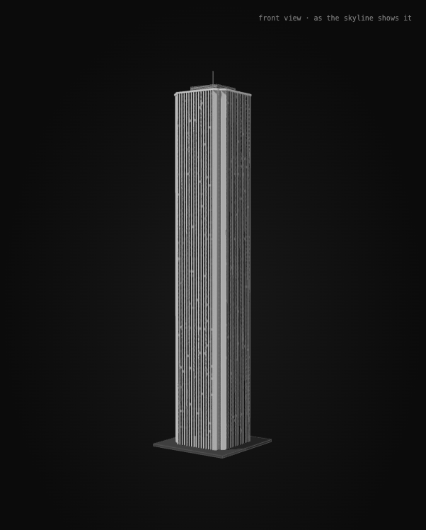

# Aon Center: reference audit

Two models share one tower. `src/models/aon-tower.ts` builds it from an outline and the
heights below; the rest supply those:

| Model | Factory | Plan | Used by |
| --- | --- | --- | --- |
| Skyline copy | `createAonCenterBuilding` in `src/models/aon-center.ts` | Clean 59.15 m square, from the drawing's datum up | Original layout of `skyline-study.html` |
| Geographic | `createAonGeographicBuilding` in `src/models/aon-geographic.ts` | The mapped outline and rooftop part, exactly | Geographic layout |

Both are reconstructions from published data and photographs, not a survey or
construction drawings.

## References checked September 27, 2026

- [OpenStreetMap ground outline 64388609](https://www.openstreetmap.org/way/64388609)
  and rooftop part 284775635. The local coordinate snapshot and attribution remain in
  `src/models/skyline-geography-data.ts` and [the geographic audit](skyline-geography.md).
- [Council on Tall Buildings and Urban Habitat / Skyscraper Center](https://www.skyscrapercenter.com/building/aon-center/339):
  346.3 m architectural height and a 362.5 m antenna tip.
- [Wikipedia](https://en.wikipedia.org/wiki/Aon_Center_(Chicago)): 83 floors, a tubular
  steel frame with V-shaped perimeter columns, and the Carrara marble cladding replaced
  by Mount Airy white granite in 1990–1992.
- [WikiArquitectura](https://en.wikiarquitectura.com/building/aon-center/): a 59.15 m
  square framed tube, "15 vertical bands of black windows on each side of the building,
  embedded between white triangular pillars", 3.86 m between floors, and a two-level
  plaza around it.
- The [Aon Center tenant portal](https://www.aoncenter.info/main.cfm?pid=aboutaon&sid=about),
  the [Chicago Architecture Center](https://www.architecture.org/online-resources/buildings-of-chicago/aon-center),
  and the [recladding engineer's project profile](https://www.wje.com/assets/pdfs/projects/Amoco_Building.pdf).
- [A May 2016 photograph](https://commons.wikimedia.org/wiki/File:Aon_Center_in_Chicago_May_2016.jpg),
  checked September 28, 2026: in daylight the dark slots between the columns run unchanged
  up to the cap, with no band over the mechanical floors.
- `skyline.jpg`, the repository's 2013 panorama from the Adler Planetarium's lakefront.
  The drawing was traced from it, and `scripts/fit-geographic-camera.ts` recovers its
  camera; see [the geographic audit](skyline-geography.md#skyline-camera). Across the
  tower's full silhouette, 6.2 photo pixels are one metre at Aon.

## Plan

The tower is a 59.15 m square with a notch cut into each corner. Each main face holds
fifteen 10 ft (3.048 m) bays between V-shaped columns, the fifteen bands of windows
that the descriptions, the drawing's fifteen strips per face, and the photograph all
count. In the photograph, the south face's lit top spans 246 pixels at a 3.03 m bay
pitch, and the dark notch beside it about 52. Fifteen bays predict 243 pixels, and a
6.7 m notch predicts 57. The mapped outline's notches run about 1.5 m deeper, leaving
its faces about 42.5 m. The geographic model now preserves the observed fifteen
openings by fitting their spacing to those faces; this supersedes the former
fourteen-bay approximation (see the October 4 research entry below).

| Feature | Mapped | Clean plan |
| --- | --- | --- |
| Outline | 59.2 × 60.3 m, faces within 1° of the grid | 59.15 m square |
| Main face | About 42.5 m, fifteen bays of about 2.85 m | 45.72 m, fifteen bays of 3.048 m |
| Corner notch | 7.7–8.9 m along each face: chamfer, square step, chamfer | 6.715 m: 1.9 m chamfer legs, 2.9 m step |
| Rooftop enclosure | Part 284775635, 31.6 × 32.8 m, centred | 32 m square, centred |

The geographic model keeps the mapped outline to the millimetre; its grade vertices are
the mapped footprint's. Where the trace splits a face into nearly collinear pieces, the
facade stands on the whole face's chord. The clean plan uses the published square and
the counted bays.

## Heights

| Feature | Height | Basis |
| --- | ---: | --- |
| Lobby | 0–11.9 m | What eighty office floors leave below the mechanical floors; estimate |
| Office floors | 80 at 3.87 m | Photograph 3.87 m (24.0 px), WikiArquitectura 3.86 m |
| Mechanical floors | 321.5–338.5 m | The night photograph's lit band's top and bottom |
| Granite cap | 338.5–340 m | Photograph; OSM shaft top 340 m |
| Rooftop enclosure | 340–346.3 m | OSM part top, the published architectural height |
| Antenna | to 362.5 m | Published tip; at the enclosure's centre, since the map gives no antenna |

The lobby, eighty office floors, and the two mechanical floors make the published 83. The
night photograph shows the mechanical floors as a bright band. In daylight their slots look
like the office floors' below, so the glass keeps the office floors' 3.87 m pitch up to the
cap.

## Tube

The V-shaped columns are granite prisms 1.3 m wide on the wall, pointing 0.7 m out,
from just above grade to the cap. Their size is an estimate from the photograph's
double-edged column shadows. Between them, each floor has a ribbon of dark glass 0.8–3.1 m
above the floor, cut into panes at the columns, with a few lit or dimmed; the ribbons run on
over the mechanical floors to the cap. The spandrels between floors stay dark, so each slot
reads as one dark strip from the lobby to the cap. The lobby is a single tall storey of
glass. The granite cap stands clear of the columns' points and follows the notches, mitred at every corner.
The notches themselves are solid stone, as the photograph's lit corner strips and the
drawing's broad corner strips show. The rooftop enclosure has louvered walls, and a
slim mast rises from its centre.

Omitted: the plaza and its fountain, entrances, signage, aviation lights, and rooftop
equipment other than the enclosure and mast. Colours follow the original artwork's
grayscale palette.

## The skyline copy

The drawing shows Aon from the photograph's treeline up, and the skyline study's platform
datum is that treeline. The skyline copy is the tower from 30.6 m above the street, and
`skyline-study.ts` scales it by 1.329, turns it 10.2°, and places it. These were fitted
through the skyline camera at all five test layouts. The fit used the drawn roof edge's
ends and near corner, the fifteen drawn piers on each face, and seventy-three of the
drawn floor bands. The rotation turns the copy's faces to meet the camera at about 31°,
as the real tower meets the photograph. Depth keeps the earlier placement, since the
drawing cannot fix it.

The copy keeps the building's proportions at a uniform 1.329. Stretching its height 2.6%
would bring the floor bands closer. It would also push the roof's east end further out,
since the drawn east end drops 67 layer units below the near corner. That is more than
a level roof drops through the skyline's long lens.

Measured at all five layouts:

| Feature | Worst error | Tolerance |
| --- | ---: | ---: |
| Roof landmarks (the east end, at the desktop layout) | 0.00823 | 0.0088 |
| Piers | 0.0025 | 0.0034 |
| Floor rows (the drawing spaces its bands about 2.5% wider) | 0.00692 | 0.0075 |

The drawing leaves its top 160 layer units without bands, over the mechanical floors the
night photograph shows lit, and draws no enclosure or antenna. The copy carries its glass
there, and includes the enclosure and antenna, as photographs show them.

## Verification

`bun run check` covers both:

- `tests/building-kit.test.ts` checks the skyline copy and the geographic model for
  counted triangles, winding, same-facing coplanar overlaps, and covered omissions. It
  checks that every mesh of the skyline copy closes edge for edge, and raycasts each
  drawn floor row onto its window glass.
- `tests/skyline-study.test.ts` projects the skyline copy against the drawing at five
  layouts:
  - the roof landmarks, with the near corner above both ends;
  - twenty-eight piers, each the first surface on its sight line;
  - six floor rows;
  - the notch's span against the drawn corner stone.

  It also checks hover and occlusion.
- `tests/skyline-geography.test.ts` raycasts the geographic model:
  - the roof, the enclosure, and the antenna tip;
  - the antenna at the enclosure's area centroid;
  - on the mapped south face, glass, spandrel and column, then the top floor's glass under
    the cap, and the cap, with no band of louvers;
  - all four notches, solid and painted stone;
  - the exact mapped outline at grade.

  Every mesh is closed.

Reference pages are research inputs only; the viewer downloads nothing from them.

## 2026-10-04: fifteen bays on the geographic model (FID-AON-001)

Selected from the [fidelity queue](building-fidelity.md): the mapped model's
fourteen-bay approximation contradicted the fifteen openings already recorded
for the clean model. This affects the full height of four visible facades.

### New evidence

All inputs below were opened on **2026-10-04**. No third-party image or PDF is
redistributed; the viewer continues to load only local geometry.

| Source | Locator and date | Observation and confidence | Decision |
| --- | --- | --- | --- |
| [Aon Center, Suite 1300 leasing plan](https://www.aoncenter.info/pdf/Suite1300.pdf), tenant portal; Telos Group / Jones Lang LaSalle | Page 1, four outer walls labeled Lake, Stetson, Columbus, Randolph. Drawing/publication date unknown. | **Observed, high confidence:** counting triangular perimeter piers gives 16 per face and 15 intervening openings on each of four faces. Interior partitions are not facade bays. The sheet has no exterior dimension string establishing metre spacing. | Fix the shared generator's count at 15, independently of map trace length. Do not derive survey dimensions from this leasing diagram. |
| [Chicago Architecture Center, Aon Center](https://www.architecture.org/online-resources/buildings-of-chicago/aon-center/), photograph credited to Eric Allix Rogers | Second gallery photograph, [direct image](https://images.architecture.org/api/v1/image/assets%2Fe61abde79d954ddab2b6092044c4b5a1%2F78b478f8953c4a9f9966504317833c6d), 994 × 1500 px; capture date unknown | **Observed, high confidence:** 15 dark slots between the solid corner strips on each of the two visible faces. Counted just below the cap; on the left face slot centres are approximately x = 257, 269, 281, 293, 305, 317, 329, 341, 354, 366, 378, 391, 403, 415, 428 px. These are counting aids, not dimensional measurements. | Corroborates the leasing plan's count and the existing panorama audit. |
| [WJE, Amoco Building (Aon Center)](https://www.wje.com/assets/pdfs/projects/Amoco_Building.pdf), recladding engineer | Page 1, Background and Solution; publication date unknown | **Documented:** white Mt. Airy granite replaced deteriorated marble while preserving the facade's appearance. Does not specify bay count or pitch. | Retain granite piers; no material or dimensional change inferred from this report. |

Inspected binary identities (SHA-256):

- Suite 1300 PDF: `c35427cc9da0ab31f45c99814bd49ed832e68e5236c0bc1fb1bbc2f2f03023cb`.
- Rogers photograph: `14131c1578024088291343d4752aae5b519eca3e8d6ee63769a3648f6f6d11f3`.

### Resolution and remaining uncertainty

At base commit `6e3067635b8204e49c1d72011eea549e84d5c79f`,
`buildAonTower` rounded each mapped face length by a nominal 3.048 m module,
producing 14 bays. The new `aonLevels.baysPerFace` preserves the observed 15.
The clean drawing-fit model already had 15, so its bay positions and camera fit
remain the same. In both forms the window ribbons now stop at the end piers'
centres; otherwise glass can peek past their V-shaped edges as two tiny extra
slots. The raycast scan exposed this while exercising the skill.

This correction represents the established facade, consistent with the 2013
panorama audit. Unknown dates on the new plan and photo do not establish a
later renovation. The geographic faces remain about 42.5–43 m wide because
their mapped notches are deeper than the clean plan. Fifteen bays therefore
have about 2.85 m pitch, **an approximation**, not the nominal 10 ft dimension.
FID-AON-002 remains open for dimensioned evidence before changing the plan.
Heights, placement, ground vertices, rooftop enclosure and building inventory
are unchanged. The geographic factory is used by the 3D skyline, geographic
study and building-detail page.

### Acceptance and validation

The added geography regression scans all four street faces at an office-window
height, counting **15 separate visible glass intervals**, each separated by a
projecting granite pier. Its source count and geographic endpoints are recorded
independently of model exports. Existing tests retain the 340 m shaft, 346.3 m
enclosure, 362.5 m tip, solid notches and exact ground coordinates. The full
repository check also covers closed meshes, coplanar faces, the original SVG
fit, hover, occlusion, reduced motion and local-only loading.

The focused Aon tests and strict typecheck pass. Running the new scan against
base geometry fails (14 full slots plus two corner slivers on the first face);
it passes with 15 intervals on all four corrected faces. Both skill copies
pass the skill-creator validator and a recursive byte comparison.

These repository-generated renders use `building-detail.html?building=layer3`,
a 1000 × 1000 viewport, device scale 1, reduced motion, and the front-view button,
with the canvas captured after two animation frames. The baseline is the pinned
base above; the second image includes the count and end-pier corrections.
The shipping base subsequently advanced to
`cf1b8adac420cd23c1c2fdc51913325401314c38` (grayscale corrections). Comparing
the two base trees confirms that neither Aon's geometry nor its registry record
changed, so the baseline remains valid for this facade comparison.

| Before | After |
| --- | --- |
|  |  |

The front, side and rear detail views, geographic skyline and ground plan were
visually inspected. The finer facade rhythm is visible in detail; no new
silhouette or placement change was observed. Browser renders reported no page
errors.

Shipping validation on 2026-10-04:

| Check | Result |
| --- | --- |
| `SKYLINE_BASE_SHA=cf1b8adac420cd23c1c2fdc51913325401314c38 bun run check` | **PASS**, 1085.4 s. Includes geometry, package, hooks, grayscale, original fit, geographic raycasts and all browser suites. The earlier run against `6e30676…` was intentionally stopped when the base advanced. |
| `bun test tests/building-fidelity-skill.test.ts` | **PASS**. Added during review; run separately after wiring it into the runner, whose full run was already in progress. Future full runs include this step. |
| `bun test tests/skyline-geography.test.ts --test-name-pattern 'Aon'` and `bun run typecheck` | **PASS** after the review changes: mesh-only raycasts and an explicit 60 s timeout. The full run also exercised the repaired geography test. |
| Both skill-creator validators and `diff -ru` on the skill directories | **PASS**. |
| `bun run agents:check` and the full run's `tests/git-hooks.test.ts` | **PASS** with the unlisted local skill present. Inspection of the pinned `agent-tool` installer confirms it enumerates bundled skill names; it does not prune unrelated directories. |

Review repairs also added the automatic copy invariant and clarified that the
older baseline image has unchanged Aon geometry relative to the shipping base.
FID-AON-001 is implemented; FID-AON-002 remains open.

## 2026-10-09 — Night colours from the panorama (FID-COL-001)

Withdrawn from the trial on 2026-10-09 at the owner's request for a sunny day: the daytime colours
below (FID-COL-003) replace these in `src/models/colour-palette.ts`. The findings stand as the night
photograph's record.

Source: `src/skyline.jpg`, the repository's 2013 night panorama from the Adler Planetarium's
lakefront, the photograph the drawing traces (19915 × 5315 px; SHA-256
`f6001e46471ea59f6fc07ae0eb9e7d5d8d243666f57d96d7efc6f59f2d7d5db4`; photographer and exact date
unknown; inspected 2026-10-09). It records the building under the city's night lighting in 2013,
so these are **observed** night colours, not the materials' daylight colours.

Method: `scripts/measure-group.ts` aligned the building's drawn group with the photograph
(`skyline.svg` places the image at x −15558.758, y −1754.2251, 26553.332 × 7086.6665 in the
drawing's layer space). Each sample is a box in photograph pixels (x0, y0, x1, y1, half-open), a
rule on hue (degrees), saturation and value (0–1) choosing one material's pixels in it, and the
per-channel sRGB median of those pixels (0–255), with their count, their share of the box and the
quartiles of red, green and blue. `bun scripts/sample-colours.ts night layer3` reproduces these rows
and prints the palette entries they gave, decoding the photograph in Chrome without colour
management. Single pixels at this scale mix neighbouring materials, which the quartiles show; the
medians are the values used.

| Material | Box | Rule | Pixels (share) | Median R, G, B | Quartiles R / G / B |
| --- | --- | --- | ---: | --- | --- |
| Granite, south | 15275, 1600, 15520, 3300 | hue 10–55, sat 0.1–0.65, val 0.3–0.88 | 187,627 (45.0%) | `115, 90, 73` | 101–133 / 77–107 / 62–87 |
| Granite, east, for comparison | 15545, 1600, 15700, 3300 | hue 10–55, sat 0.1–0.65, val 0.2–0.88 | 68,140 (25.9%) | `98, 80, 70` | 82–113 / 68–94 / 60–80 |
| Unlit glass | 15275, 1600, 15520, 3300 | val 0–0.2 | 42,763 (10.3%) | `43, 28, 27` | 36–47 / 24–31 / 23–31 |
| Lit windows | 15275, 1600, 15520, 3300 | sat 0–0.3, val 0.8–1 | 51,630 (12.4%) | `249, 242, 237` | 239–254 / 227–250 / 214–249 |
| Lit cap | 15275, 1400, 15520, 1490 | sat 0–0.3, val 0.75–1 | 14,348 (65.1%) | `243, 239, 236` | 231–248 / 225–244 / 219–243 |

Decisions in `src/models/colour-palette.ts`:

- `white granite` `115, 90, 73`: the white granite piers read a warm brown at night, lit from the
  street; also the tube shell.
- `glass` `43, 28, 27`, the window ribbons and their dark spandrels.
- `cap lights` `243, 239, 236`, the cap, where the top floors and the cap read as one lit band.
- `lit window` `249, 242, 237`; `dim window` takes it at the dim windows' grey.
- `aluminium` (the enclosure's slats), `stainless` (the mast) and `neutral` (core and roofing) stay
  grey.

Acceptance checks: `tests/colour-materials.test.ts` finds each measured colour, at the colour
layer's exposure of 2.1, on the building's surfaces of that material, and leaves its unmeasured ones
grey. In the skyline view at 1600 × 900, the rendered south piers' median is 1.22 of the
photograph's in linear light.

## 2026-10-09 — Daytime colours from Chicago.jpg (FID-COL-003)

At the owner's request the colour trial shows a sunny day, so these colours replace the night
colours above in `src/models/colour-palette.ts`.

Source: [Chicago.jpg](https://commons.wikimedia.org/wiki/File:Chicago.jpg) on Wikimedia Commons,
Daniel Schwen's panorama of the skyline from the Adler Planetarium, photographed on 16 August 2008
from 22 frames on a Canon EOS 5D with a 150 mm lens (CC BY-SA 4.0; accessed 2026-10-09). Measured in
Commons' 3840 × 551 px rendition,
`https://upload.wikimedia.org/wikipedia/commons/thumb/7/77/Chicago.jpg/3840px-Chicago.jpg` (SHA-256
`a1d033489368cfa22a2d178d6a2ad82d00f9b529189836bee739b89b2e8cba41`); the photograph is not in the
repository. It looks from nearly the drawing's viewpoint on a sunny day, five years before the 2013
night panorama the drawing traces. The white granite is the 1990s recladding the 2013 panorama also
shows. The sun is high in the south: the south faces, which the lakefront sees nearly square, are
lit, and the east faces are in shade (observed).

Method: each sample is a box in the rendition's pixels (x0, y0, x1, y1, half-open), a rule on hue
(degrees), saturation and value (0–1) choosing one material's pixels in it, or all of them, and the
per-channel sRGB median of those pixels (0–255), with their count, their share of the box and the
quartiles of red, green and blue. `bun scripts/sample-colours.ts day layer3` downloads each
photograph once, checks its SHA-256, and reproduces these rows and the palette's entries, decoding
in Chrome without colour management. The building is about 57 pixels wide in the rendition, so
single pixels mix neighbouring materials, which the quartiles show; the medians are the values used.
Samples take the sunlit face where the photograph shows one.

| Material | Box | Rule | Pixels (share) | Median R, G, B | Quartiles R / G / B |
| --- | --- | --- | ---: | --- | --- |
| Granite, sunlit | 1815, 160, 1860, 450 | sat 0–0.12, val 0.6–1 | 6,795 (52.1%) | `223, 223, 221` | 182–244 / 182–245 / 181–242 |
| Glass | 1815, 160, 1860, 450 | val 0–0.4 | 3,380 (25.9%) | `66, 66, 64` | 55–80 / 55–79 / 53–78 |
| Shaded face, for comparison | 1852, 170, 1866, 440 | all | 3,780 (100.0%) | `129, 135, 136` | 107–211 / 113–211 / 117–207 |

Decisions in `src/models/colour-palette.ts`:

- `white granite` `223, 223, 221`, the sunlit south piers; the shaded east face, all its pixels with
  the windows, measures `129, 135, 136`.
- `glass` `66, 66, 64`, the window slots; `lit window` and `dim window` take it exactly, since no
  office lights show by day.
- `cap lights`, the cap the night shows lit, takes the granite's colour: by day it is the same
  stone. Inferred.
- `aluminium` (the enclosure's slats), `stainless` (the mast) and `neutral` stay grey.

Acceptance checks: `tests/colour-materials.test.ts` finds each measured colour, at the colour
layer's exposure of 1.4, on the building's surfaces of that material, and leaves its null ones grey.
In the skyline view at 1600 × 900 under the day lights, the south piers render `207, 208, 208` under
the photograph's rule, 0.86 of the photograph's brightness in linear light; the granite just passes
white at its own grey at this exposure. The east face renders `106, 122, 137` against the
photograph's `129, 135, 136`, 0.83, and bluer, its shade lit by the sky's colour.

## 2026-10-10 — Calibration reference for a close-up (FID-COL-006)

The sampler's day study also measures Aon's granite in an overcast close-up of the Hyatt Regency
from about 2007, `163, 165, 168` (box 530, 130, 610, 380, sat 0–0.12, val 0.6–1), as the reference
that calibrates that close-up to the panorama for the Hyatt Regency's west tower
(`hyatt-west-tower-reference.md`). `bun scripts/sample-colours.ts day layer3` prints that row after the
FID-COL-003 rows; this building's palette entry is unchanged.
